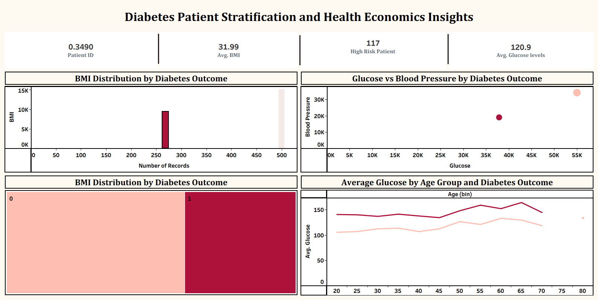

# PharmaQuant Health Economics Analysis



## 📌 Overview
This project focuses on a **comprehensive health economics analysis** using SQL, Python, and Tableau.  
The work is inspired by PharmaQuant’s focus on **health technology assessment (HTA), market access, and evidence-based healthcare decision-making**.  

The project demonstrates **end-to-end analytics skills**: from raw data exploration with SQL, predictive modeling with Python, to interactive dashboards in Tableau.  
It is structured to showcase skills highly relevant for **Health Economist and Data Analyst roles**.

---

## 🗂 Project Structure
- **PharmaQuant Health Economics Analysis.ipynb** → Python notebook with cleaning, exploration, and ML modeling.  
- **PharmaQuant Health Economics Analysis.sql** → SQL queries for patient-level data analysis.  
- **PharmaQuant Health Economics Analysis.twbx** → Tableau workbook with interactive dashboards.  
- **Diabetes.csv** → Dataset used for the project.  
- **Dashboard.png** → Exported Tableau dashboard screenshot (preview at top).  

---

## 🔎 Key Files & What They Contain
- **PharmaQuant Health Economics Analysis.ipynb**
  - Data ingestion and preprocessing
  - Exploratory Data Analysis (distributions, correlations, missing-value handling)
  - Feature engineering and transformations
  - Predictive modeling pipeline (train/test split, model training, evaluation)
  - Model explainability (feature importance, SHAP/partial dependence if included)
  - Full reproducible code and inline interpretations

- **PharmaQuant Health Economics Analysis.sql**
  - 18 SQL queries answering data-focused questions (patient-level summaries, cohorts, aggregations, joins)
  - Examples: BMI distribution by outcome, glucose-level stratification, cohort counts, group comparisons
  - Ready to run in **MySQL Workbench**

- **PharmaQuant Health Economics Analysis.twbx**
  - Interactive Tableau workbook with multiple dashboards
  - Visuals include:
    - BMI Distribution by Diabetes Outcome (binned histogram)
    - Age vs Glucose scatterplots (with Outcome filter)
    - Comparative summary KPIs (counts, mean BMI, mean glucose by outcome)
    - Interactive filters/slicers for quick subgroup analysis

---

## ✅ Analysis Summary & Insights
> _Replace placeholders below with exact numbers from your notebook if you want precise claims._

- **Variables examined:** BMI, Glucose, Age, BloodPressure, Insulin, SkinThickness, DiabetesPedigreeFunction, Outcome.
- **SQL insights:** Cohort counts and subgroup summaries (e.g., % with BMI ≥ 30, median glucose by outcome, top age brackets by prevalence).
- **EDA findings:** Clear distribution differences in BMI and glucose for Outcome = 1 vs Outcome = 0 (see notebook visualizations).
- **Modeling approach:** Logistic Regression, Random Forest, and Support Vector Classifier were trained with standard preprocessing (scaling/imputation as applied).
  - Evaluation metrics (please update with actual values from notebook):
    - `Random Forest` — Accuracy: **<ADD ACCURACY>%**, AUC: **<ADD AUC>**
    - Confusion matrix and ROC curves available in the notebook.
  - **Top predictors / feature importance**: (examples that typically matter) `Glucose`, `BMI`, `Age` — see notebook for exact ranking.
- **Tableau takeaways:** Visual dashboards created for quick decision-maker interpretation — clear color coding for Outcome (diabetic vs non-diabetic), interactive filters to inspect subgroup-level risk.

---

## 📊 Tools & Technologies
- **SQL** → MySQL Workbench for structured data queries.  
- **Python** → Jupyter Notebook for cleaning, analysis, and ML.  
- **Tableau** → Tableau Public for dashboards and storytelling.  
- **GitHub** → Version control and project showcase.  

---

## 🚀 How to Run
1. Clone this repository:  
   ```bash
   git clone https://github.com/snehez/PharmaQuant-Health-Economics-Analysis.git

---

## 👩‍💻 Author
**Sneha**  
- Aspiring Data Analyst | Business Insights | Risk Analytics  
- 🌐 [LinkedIn](https://www.linkedin.com/) | [GitHub](https://github.com/snehez)  

---
